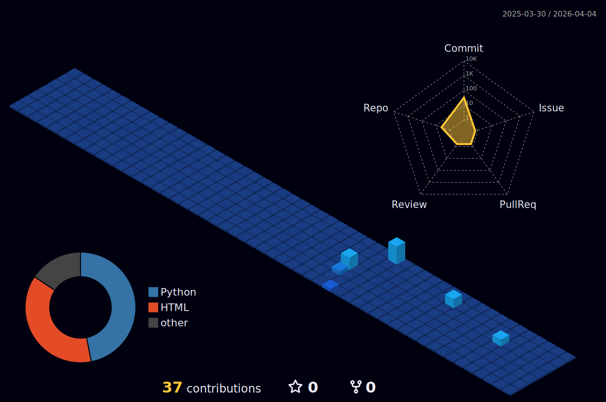

<!-- Header Wave -->

 
 

  <!-- Neon Intro -->

  <!-- Neon Intro -->

<!-- New GIF before Current Focus section -->

    

## 🚀 Current Focus

🔬 <strong> Exploring data visualization in biotechnology and healthcare</strong>  
💻 <strong> Building full-stack web applications and problem-solving through code</strong>  
🎓 <strong>Mastering DSA and competitive programming alongside biotech coursework</strong>  
🌱 <strong>Contributing to open-source projects that blend tech and sustainability</strong>

  <!-- Previous GIF (kept for reference, but you can remove if you want) -->

### 💻 TECH STACK

 

<!-- Languages -->

 

<!-- Frontend -->

 

<!-- Backend / Tools -->

<!-- Smaller GIF added before Connect section -->

  

### 🌐 Connect

  <!-- Email with banner image (increased size) -->
  
  
  <!-- LinkedIn with animated GIF (increased size) -->
  
  
  <!-- GitHub with animated GIF (increased size) -->
  

 

 

  

 

### 📊 GitHub Stats

 

<table style="border: none; width: 80%; margin: 0 auto;">
  <tr>
    <td style="width: 50%;">
      
    </td>
    <td style="width: 50%;">
      
    </td>
  </tr>
  <tr>
    <td colspan="2" style="text-align: center;">
      
    </td>
  </tr>
</table>

  <!-- Left side GIF -->
  

    
  

 

  

 

### 🌙 GitHub 3D Contributions

 

 

<!-- GIFs on left and right sides before footer -->

  <!-- Left side GIF -->
  

    
  

  

